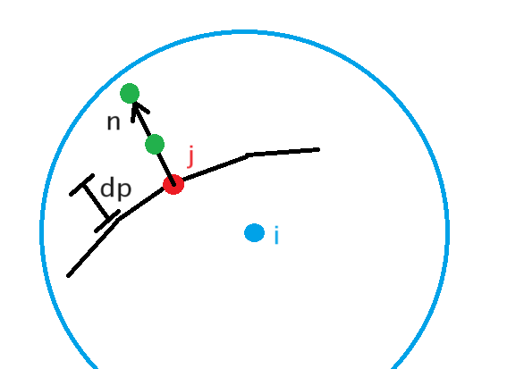
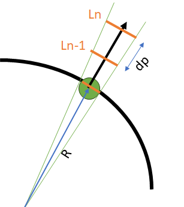

# Algorithm for one-sided FSI problem
The basic idea is to retrieve kernel completeness by using dummy shell contact particles. The algorithm is summarized below:

# Ghost particle integration
For a shell particle with index j in the neighborhood of a fluid particle i, we integrate the force dW_ijV_je_ij by considering ghost particles.

First, we check if the shell particle itself is in the support of fluid particle i. If $r_{ij}^0$ is smaller than the cut-off radius of fluid, we calculate the force $\nabla W_{ij}^0 A_j^0=dW_{ij}^0 \mathbf{e}_{ij}^0 A_j^0$. Here $A_j^0$ is the area of the shell particle.

Then we calculate the contribution of the n-th ghost particle. The distance between ghost particles is the reference spacing of shell $dp_s$. The position of the n-th particle is then:

$$\mathbf{r_{ij}^n}=\mathbf{r_{ij}^0} + n\cdot dp_s \cdot \mathbf{n_j}=\mathbf{r_{ij}^{n-1}}+dp_s \cdot \mathbf{n}$$

where $\mathbf{n_j}$ is the corrected normal direction of shell particle j, which points from fluid to shell.

If the distance $r_{ij}^k=\|\mathbf{r_{ij}^n}\|$ is less than the cut-off radius of fluid particle, we will sum up the force provided by this ghost particle. The process is repeated until $r_{ij}^N$ becomes greater than the cut-off radius, or when the area / volume of the ghost particle becomes negative. 

The method is illustrated in the graph below:



The calculation of ghost particle area $A_j^n$ will be explained in detail in the next sections.

# Equivalent forces
For fluid-shell interaction, there are 4 classes using information in the contact neighbourhood:
## `DensitySummationComplex`

In the density summation of fluid with wall contact, the contribution of a wall particle j is calculated as:
$$\sigma_j = \frac{1}{\rho_j}W_{ij}m_j$$
The total contribution of a shell particle j with its ghost particles n will be:
$$\sigma_j = \frac{1}{\rho_j}\sum{W_{ij}^n m_j^n}=\sum_n{W_{ij}^n A_j^n dp_s}$$
It can be reformulated using the mass of shell particle $m_j=\rho_j A_j^0 t_j$ and the equavilent $\overline{W_{ij}}$:
$$\sigma_j = \frac{1}{\rho_j}\overline{W_{ij}}m_j=\overline{W_{ij}} A_j^0 t_j$$
By comparing these two equations, we can obtain the formulation of $\overline{W_{ij}}$:
$$\overline{W_{ij}}=\frac{1}{A_j^0}\sum_{n=0}^N W_{ij}^k A_j^n \cdot \frac{dp_s}{t_j}$$

## `Integration1stHalfWithWall`
In the 1st part of integration (pressure relaxation), the force on fluid particle i from a wall particle j reads:
$$\mathbf{f} = -V_i \cdot (p_i + p_w) \cdot \overline{dW_{ij}V_j} \cdot \overline{\mathbf{e_{ij}}}$$
By assuming that the dummy wall pressure $p_w$ is the same for each ghost particle, we have:
$$\mathbf{f} = -V_i \cdot (p_i + p_w) \cdot \sum_n{(dW_{ij}V_j)^n \cdot \mathbf{e_{ij}}^n}$$
Therefore, the equavilent dW_ijV_j and e_ij should satisfy:
$$\overline{dW_{ij}V_j} \cdot \overline{\mathbf{e_{ij}}} = \sum_n{dW_{ij}^n A_j^n dp_s \cdot \mathbf{e_{ij}}^n}$$
Here the dummy pressure $p_w$ depends on r_ij and e_ij, but it's difficult to find an equivalent expression for these terms. As an estimation, it is assumed to be unchanged.  

## `Integration2ndHalfWithWall`
In the 2nd part of integration (density relaxation), the density change is calculated as:

$$\frac{d \rho}{dt} = 2 \rho_i \cdot [(\mathbf{v_i} - \mathbf{v_w}) \cdot \mathbf{e_{ij}}] \cdot \overline{dW_{ij}V_j}$$

By assuming that $[(\mathbf{v_i} - \mathbf{v_w}) \cdot \mathbf{e_{ij}}]$ is constant for each ghost particle, we have:

$$\frac{d \rho}{dt} = 2 \rho_i \cdot [(\mathbf{v_i} - \mathbf{v_w}) \cdot \mathbf{e_{ij}}]  \cdot \sum_n({dW_{ij}V_j})^n$$

Thus the equivalent term can be written as:

$$\overline{dW_{ij}V_j}=\sum_{n=0}^N dW_{ij}^n A_j^n dp_s$$

Substituting this part back to the equation of $\overline{dW_{ij}V_j} \cdot \overline{\mathbf{e_{ij}}}$, we have:
$$\overline{\mathbf{e_{ij}}}=\frac{\sum_{n=0}^N dW_{ij}^n A_j^n\mathbf{e_{ij}^n}}{\sum_{n=0}^N dW_{ij}^n A_j^n}$$

## `ViscousForceWithWall`
The viscous force from a wall particle j reads:

$$\mathbf{f} = 2\mu V_i \cdot \frac{2(\mathbf{v_i} - \mathbf{v_j})}{r_{ij}} \cdot \overline{dW_{ij}V_j}$$

Here the derivative term is related to $r_{ij}$, but if the distance is modified according to the equivalence of viscous force, the estimation of dummy wall pressure seems to become worse. Therefore, the contribution of ghost particles to the distance $r_{ij}$ is not considered.

## Equivalent terms
The equivalent terms in the neighbourhoods are listed below:
$$\overline{r_{ij}}=r_{ij}^0$$
$$\overline{W_{ij}}=\frac{1}{A_j^0}\sum_{n=0}^N W_{ij}^k A_j^n \cdot \frac{dp_s}{t_j}$$
$$\overline{dW_{ij}V_j}=\sum_{n=0}^N dW_{ij}^n A_j^n dp_s$$
$$\overline{\mathbf{e_{ij}}}=\frac{\sum_{n=0}^N dW_{ij}^n A_j^n\mathbf{e_{ij}^n}}{\sum_{n=0}^N dW_{ij}^n A_j^n}$$

# Update volume change


The area of the ghost particles is modified by the curvature of shell with the assumption of a cone-shape length change, as shown in the figure above. For the 2D case, the length of the particle along the normal direction can be written as:

$$l^n=\alpha (R+n\cdot dp)$$

where superscript $n$ refers to the nth dummy particle, $dp$ is the particle reference resolution, curve radius $R=1/k$ and $\alpha$ is the angle of the cone.

The length of the real shell particle is:

$$l^0=\alpha R$$

Thus, the length of the n-th dummy particle takes the form:

$$l^n=l^0(1+n\cdot dp/R)=l^0(1+n\cdot dp \cdot \kappa)$$

where $\kappa$ is the curvature of the curve.

For 3D problems, we can calculate the length in two principal directions, and thus the area can be computed as:

$$A^n=A^0(1+n\cdot dp \cdot \kappa_1) \cdot (1+n\cdot dp \cdot \kappa_2)$$

# Shell curvature computation
In this section, we present how to calculate the curvature of a deforming shell. Then the limitations of this method and the average curvature calculation will be discussed.

We can compute the total curvature H and Gaussian curvature K by:

$$H=\kappa_1 + \kappa_2 = \nabla \cdot \mathbf{n}_r$$

$$K=\kappa_1 \cdot \kappa_2 = \frac{1}{2}[(\nabla \cdot \mathbf{n}_r)^2-\sum_i \sum_j (\frac{\partial n_j}{\partial x_i}\frac{\partial n_i}{\partial x_j})]$$

where $\mathbf{n}_r$ is the normal direction of the surface, $\kappa_1$ and $\kappa_2$ are the two principle curvatures. 

For the initial configuration, the gradient of normal can be calculated as:

$$\nabla^0{\mathbf{n}^0_i}=-\sum_j{(\mathbf{n}^0_i-\mathbf{n}^0_j) \times \nabla^0W_{ij}V_j^0}$$
$$=-\sum_j{(\mathbf{n}^0_i-\mathbf{n}^0_j) \cdot (dW_{ij}^0V_j^0\mathbf{e}_{ij}^0)^T}$$

Here $\nabla^0$ is the gradient in the initial global coordinate.

To obtain a more accurate value, the B-matrix correction can be used:

$$\nabla^0{\mathbf{n}^0_i}=-[\sum_j{(\mathbf{n}^0_i-\mathbf{n}^0_j) \times \nabla^0W_{ij}V_j^0}] \cdot \mathbb{B}^G_i$$

where $\mathbb{B}^G$ is the B-matrix in the global coordinate. The transformation between local and global B-matrix can be written as:

$$\mathbb{B}^G_i = (\mathbb{Q}^0_i)^T \cdot \mathbb{B}^L_i \cdot \mathbb{Q}^0_i$$

Note that the bending deformation tensor in the current global configuration is defined as:

$$\mathbb{F}_i=-\sum_j [(\mathbf{n_i}-\mathbf{n_i^0})-(\mathbf{n_j}-\mathbf{n_j^0})]$$

$$ \times \nabla^0W_{ij}V_j^0 =\nabla^0{\mathbf{n}_i}-\nabla^0{\mathbf{n}_i^0}$$

The $\mathbf{n}_i$ used in the calculation of bending deformation is the pseudo normal, but here we assume that the changing of real and pseudo normal is very close to each other.

Thus $\nabla^0{\mathbf{n}_i}$ can be computed from the local bending deformation gradient $\mathbb{F}_2^L$:

$$\nabla^0{\mathbf{n}_i}=\nabla^0{\mathbf{n}_i^0}+(\mathbb{Q}_i^0)^T \cdot \mathbb{F}_i^L \cdot \mathbb{Q}_i^0$$

We can reuse $\mathbb{F}_i^L$ (`F_bending_[index_i]`).

The gradient in the initial configuration can be transformed to the current configuration by:

$$\nabla{\mathbf{n}_i}=(\mathbb{F}_i^{-T}\nabla^0){\mathbf{n}_i}$$

$$=-\sum_j(\mathbf{n_i}-\mathbf{n_j})\times [(\mathbb{F}_i^{-T} \cdot \mathbf{e_{ij}^0}) dW_{ij}^0 V_j^0]$$

$$=-\sum_j(\mathbf{n_i}-\mathbf{n_j})
 \cdot [dW_{ij}^0V_j^0(\mathbf{e_{ij}^0})^T \cdot \mathbb{F}_i^{-1}]$$

$$=-[\sum_j(\mathbf{n_i}-\mathbf{n_j})
 \cdot dW_{ij}^0V_j^0(\mathbf{e_{ij}^0})^T] \cdot \mathbb{F}_i^{-1}$$

$$=\nabla^0{\mathbf{n}_i} \cdot \mathbb{F}_i^{-1}$$

Here $\mathbb{F}_i$ is the bending deformation tensor in global coordinate, which can be calculated as: 
$$\mathbb{F}_i^{-1}=(\mathbb{Q}^0)^T \cdot (\mathbb{F}_i^L)^{-1} \cdot \mathbb{Q}^0$$

where $\mathbb{F}_i^L$ is `F_[index_i]`.

# Average shell curvature
One problem with using curvature to modify the volume is that the ghost particles might overlap with each other when shell particles are close to each other. For example, when a balloon has self-contact, the contact part can be nearly flat, with a curvature close to 0. The ghost particles of the upper and lower layers will thus overlap and result in an excessive repelling force.

Note that the normal vector of the upper and lower layers is nearly in the opposite direction. Since the curvature is related to the gradient of normal, we propose to use a modified curvature, which is recomputed every advective time step. The normal gradient is calculated as:

$$\nabla{\mathbf{n_i}}=-\sum_j{(\mathbf{n_i}-\mathbf{n_j}) \times \nabla W_{ij}V_j}$$

The main difference between the average curvature formulation and the curvature discussed in the previous section is summarised below:

1. No B-matrix correction is used, so that the drastic change in normal vector can be reflected in the value of normal gradient

2. W_ij and V_j are no longer the values in the initial configuration, but in the current configuration. A new inner relation will be updated and used to calculate those values. 

3. The cut-off radius of this inner relation should be the cut-off radius of fluid. When the fluid reference spacing is larger than that of shell, a fluid particle might see both the upper and lower layer of shell, though they have a distance > dp_s. Therefore, the inner relation should also have a larger cut-off radius.

When there is self-contact or sharp angle in the shell, the high normal gradient will result in a large negative curvature, thus the volume of the ghost particles will tend to 0, avoiding the overlapping.

# Shell-fluid contact
For the contact from fluid to shell, `dW_ijV_j` and `e_ij` are calculated in a similar way, satisfying the consistency of force and reaction force.

For a shell particle i and its neighbouring fluid particle j, a ghost particle is generated along the normal direction. `dW_ijV_j` and `e_ij` at those ghost particles are summed up to calculate the equivalent terms.

## Viscous force
The viscous force of fluid particle j on shell particle i is formulated as:
$$\mathbf{f_i} = 2\mu V_i \cdot \frac{2(\mathbf{v_i} - \mathbf{v_j})}{r_{ij}} \cdot \overline{dW_{ij}V_j}$$

Here V_i is the area of shell particle i.

Assuming r_ij to be constant, we have:
$$A_i^0  \cdot \overline{dW_{ij}V_j} = \sum_n A_i^n dp_s dW_{ij}^n V_j$$

Then:
$$\overline{dW_{ij}V_j} = \sum_n \frac{A^n}{A^0}dW_{ij}^n V_j dp_s$$

## Pressure force
The pressure force reads:
$$\mathbf{f} = -V_i \cdot (p_w + p_j) \cdot \overline{dW_{ij}V_j} \cdot \overline{\mathbf{e_{ij}}}$$

Analogously, by assuming p_w is constant, we have:
$$A_i^0 \overline{dW_{ij}V_j} \overline{\mathbf{e_{ij}}} = \sum_n A_i^n dp_s dW_{ij}^n V_j \mathbf{e_{ij}^n}$$

Thus, the equivalent e_ij is:
$$\overline{\mathbf{e_{ij}}} = \frac{\sum_n \frac{A_i^n}{A_i^0} dp_s dW_{ij}^n V_j \mathbf{e_{ij}^n}}{\overline{dW_{ij}V_j}} = \frac{\sum_n \frac{A_i^n}{A_i^0} dW_{ij}^n V_j \mathbf{e_{ij}^n}}{\sum_n \frac{A^n}{A^0}dW_{ij}^n V_j}$$

W_ij is not modified since it is not used in fluid force computation. 

# Implementation in the code
We have those new classes:

1. Neighbor builder

`BaseNeighborBuilderContactShell`: basic class for contact with shell

`NeighborBuilderContactFromShell`: build the shell neighbor of a fluid particle, calculating equivalent W_ij, e_ij and dW_ijV_j

`NeighborBuilderContactToShell`: build the fluid neighbor of a shell particle, calculating equivalent e_ij and dW_ijV_j

`ShellNeighborBuilderInnerWithContactKernel`: build the shell inner relation. The kernel is a reduced kernel, with the smoothing length of fluid

2. Contact relations

`ContactRelationFromShell`: contact to fluid from shell. If the normal of shell points from shell to fluid, `normal_corrections` should set to true, so that the normal will be flipped in the neighbor builder.

`ContactRelationToShell`: contact to shell from fluid

`ShellInnerRelationWithContactKernel`: inner contact to calculate the average curvature. The search depth is set to the search depth of fluid.

3. Curvature calculation

`AverageShellCurvature`: calculate the average principle curvatures for shell

The process of building up a fluid-shell interaction simulation will be:

1. Build contact relations and the inner relation for curvature computation

Example:

```
ContactRelationFromShell water_shell_contact(water_block, {&shell}, {false});
ContactRelationToShell shell_water_contact(shell, {&water_block}, {false});
ShellInnerRelationWithContactKernel shell_curvature_inner(shell, water_block);
```

2. Build methods used for shell curvature calculation

Example:
```
SimpleDynamics<thin_structure_dynamics::AverageShellCurvature> shell_average_curvature(shell_curvature_inner);
```

3. System configuration update

The initial curvature should be calculated after the system cell linked list and configuration has been built up. After calculating initial curvature, contact relations between fluid and shell should be updated again.

Example:
```
sph_system.initializeSystemCellLinkedLists();
sph_system.initializeSystemConfigurations();

shell_average_curvature.exec();
water_shell_contact.updateConfiguration();
shell_water_contact.updateConfiguration();
```

4. Simulation loop

During the simulation, the average curvature of shell should be recomputed before the configurations are updated. The order is: (1) Update the normal and cell-linked list of shell and fluid. If there's a drastic change in the shell area, then the volumetric measure should also be updated. (2) Update inner contact for curvature computation. (3) calculate new curvature. (4) Update fluid-shell contact and shell-fluid contact.

Example:
```
water_block.updateCellLinkedListWithParticleSort(100);
shell.updateCellLinkedList();
shell_curvature_inner.updateConfiguration();
shell_average_curvature.exec();
water_block_complex.updateConfiguration();
shell_water_contact.updateConfiguration();
```

# Reference
- Nitschke, Ingo, Axel Voigt, and Jörg Wensch. "A finite element approach to incompressible two-phase flow on manifolds." Journal of Fluid Mechanics 708 (2012): 418-438.
- Graustein, W. C. "CE Weatherburn, Differential Geometry of Three Dimensions." (1928): 785-786.
- Wu, Dong, Chi Zhang, and Xiangyu Hu. "An SPH formulation for general plate and shell structures with finite deformation and large rotation." arXiv preprint arXiv:2309.02838 (2023).